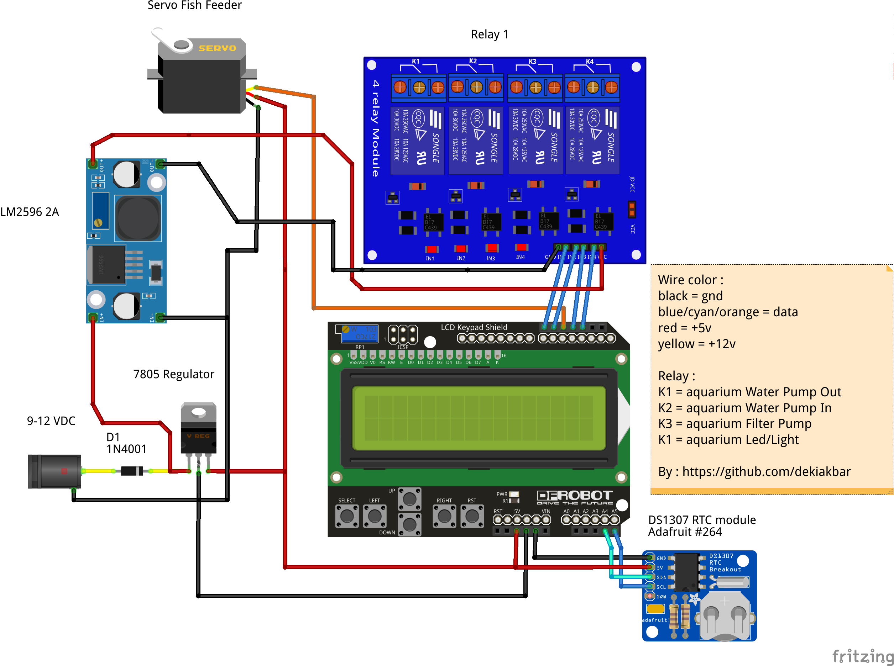

# Aquaduino
> ### Automatic Led, Fish feeder and pump controlled by arduino uno based on RTC DS1307.

## Installation

* Clone or download this repository
* Import RTC library and Servo library in libraries folder to your Arduino IDE.
* Open arduinoaquascape using your arduino Uno.
* set arduino wiring as like as on the top image of this readme.
* and youre done. enjoy :)
* Note : If you use Arduino IDE just ignore the .vscode folder (This exist because I use visual code for developing this code)

## Usage

LCD Shield button function :
* up : move up menu or increase value.
* down : move down menu or decrease value.
* right : select the menu or in some sub menu this used to move the cursor to set hours and minutes.
* left : used as back button, but on the homepage and then press left it will bring you to display taht showing time, feeder time.

## Feature
### **All of state and value will autosave on EEPROM when you change the value. So if power failure happened, no need to set up from the beginning again. Except Water Pump In and Water Pump Out state, the state is not saved on EEPROM so it will be off when you get power failure or reset the arduino**

* Set LCD Brightness
* Feed fish manually (by push the button)
* Feed fish based on intervale (ex. everi X hours or every X minutes )
* Manually set LED On or Off;
* Automatic on or off LED at specifi time (ex. LED on at 22.00 and LED off at 06.00 )
* Water pump Out ( Manual triger )
* Water Pump In ( Manual trigger )
* Set state filter pump On or Off 

## Warning

* **Please use this code properly, I am not responsible for damage or accidents caused by this code, errors in installation can blow up your components or even burn your arduino.** 
* **If you use LCD Keypad Shield please Use servo library from this project, Do not use from arduino IDE, because LCD brightness setting will not work since default servo library will disable pwm on pin 10 (used by LCD backlight on LCD Keypad Shield)**

## References / Thanks
* [Servo Timer 2](https://github.com/nabontra)
* [LCD Menu Template](https://www.instructables.com/id/Arduino-Uno-Menu-Template/)

## Meta

Deki Akbar – [@itsdekiakbar](https://twitter.com/itsdekiakbar)

Distributed under the GNU General Public License v3.0 license. See ``LICENSE`` for more information.

[https://github.com/dekiakbar/arduinoaquascape](https://github.com/dekiakbar/)

## Contributing

1. Fork it (<https://github.com/dekiakbar/arduinoaquascape/fork>)
2. Create your feature branch (`git checkout -b feature/amazing_feature`)
3. Commit your changes (`git commit -am 'Add some amazing feature'`)
4. Push to the branch (`git push origin feature/amazing_feature`)
5. Create a new Pull Request